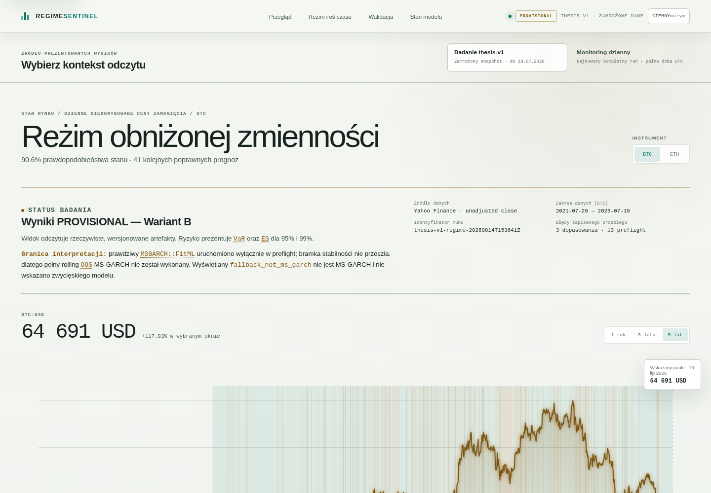
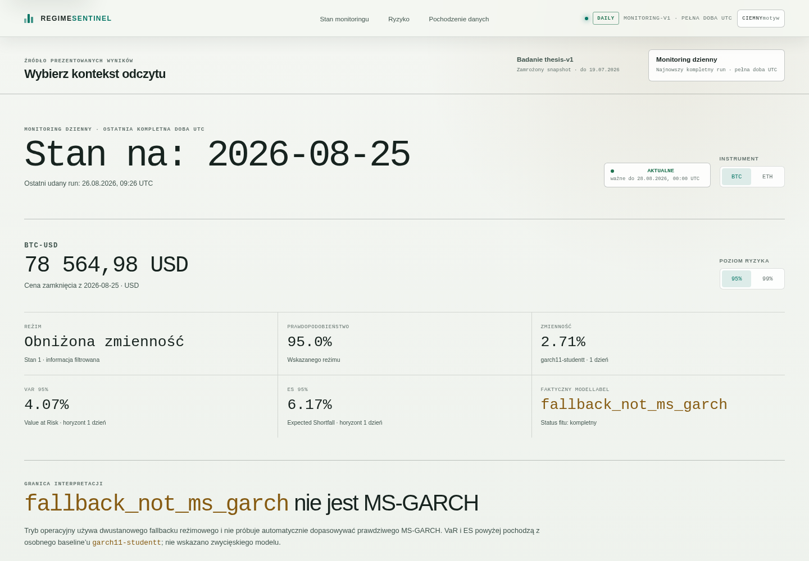

# RegimeSentinel

Repozytorium dokumentuje pracę magisterską poświęconą porównaniu modeli VaR/ES dla kryptowalut BTC-USD i ETH-USD.
Projekt łączy analizę statystyczną opartą o modele GARCH i MS-GARCH z warstwą publicznej prezentacji wyników.
Zakres obejmuje modelowanie jednowymiarowe ryzyka wstępujące przez `GARCH(1,1)` (baseline), kandydacki model przełącznikowy `MS-GARCH`, a wyniki oceniane są przy użyciu testów VaR/ES i procedury rolling backtest.

## Wynik badania

- Wariant bazowy `GARCH(1,1)` został wykonany dla obu instrumentów.
- Integracja `MSGARCH::FitML` została zweryfikowana pod kątem działania technicznego.
- W drugiej kontrolowanej próbie otrzymano 10/10 poprawnych dopasowań.
- Zamrożona bramka stabilności nie została zaliczona dla BTC-USD i ETH-USD.
- W związku z tym rolling OOS MS-GARCH nie został uruchomiony.
- Model `fallback_not_ms_garch` jest odrębnym modelem zastępczym, nie wynikiem MS-GARCH.
- Nie wybrano zwycięzcy, ponieważ porównanie OOS MS-GARCH nie powstało zgodnie z zamrożoną ścieżką badawczą.

## Aplikacja

Demo: [https://aleksanderpostrzednik.github.io/RegimeSentinel/](https://aleksanderpostrzednik.github.io/RegimeSentinel/)

Aplikacja jest warstwą prezentacji wyników, natomiast publiczne repozytorium reprodukcyjne koncentruje się na kodzie i danych użytych w analizach.

## Zawartość repo

- `data/` — zamrożone zbiory wejściowe i pliki pochodzące z pobrania źródłowego.
- `protocol/` — definicje kontraktów eksperymentu, metryk oraz reguł porównania.
- `worker/` — silnik obliczeniowy, skrypty i logika pipeline'u.
- `artifacts/` — wygenerowane wyniki, manifesty, raporty i ślady uruchomień.
- `contracts/` — jawne kontrakty wejściowe i pomocnicze schematy.

## Reprodukcja

Instrukcja reprodukcji: [Instrukcja reprodukcji](REPRODUCIBILITY.md)

## Granice

- Badanie obejmuje tylko dwa instrumenty: BTC-USD i ETH-USD.
- Dane mają częstotliwość dzienną.
- Użyto jednego okresu historycznego.
- Brak rolling OOS MS-GARCH wynika z niezaliczenia zamrożonej bramki stabilności.
- `fallback_not_ms_garch` nie jest modelem MS-GARCH.

## Źródło danych

Dane pochodzą z Yahoo Finance.

Okres badania: 20.07.2021–19.07.2026.

## Praca

Tytuł: „Detekcja zmian reżimu ryzyka: modele przełącznikowe i GARCH oraz walidacja VaR/ES w rolling backtest”

Autor: Aleksander Postrzednik

Uniwersytet Ekonomiczny w Krakowie.
