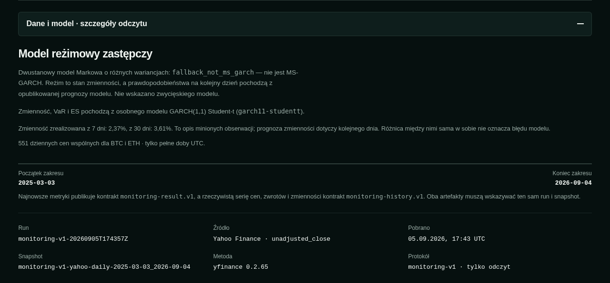
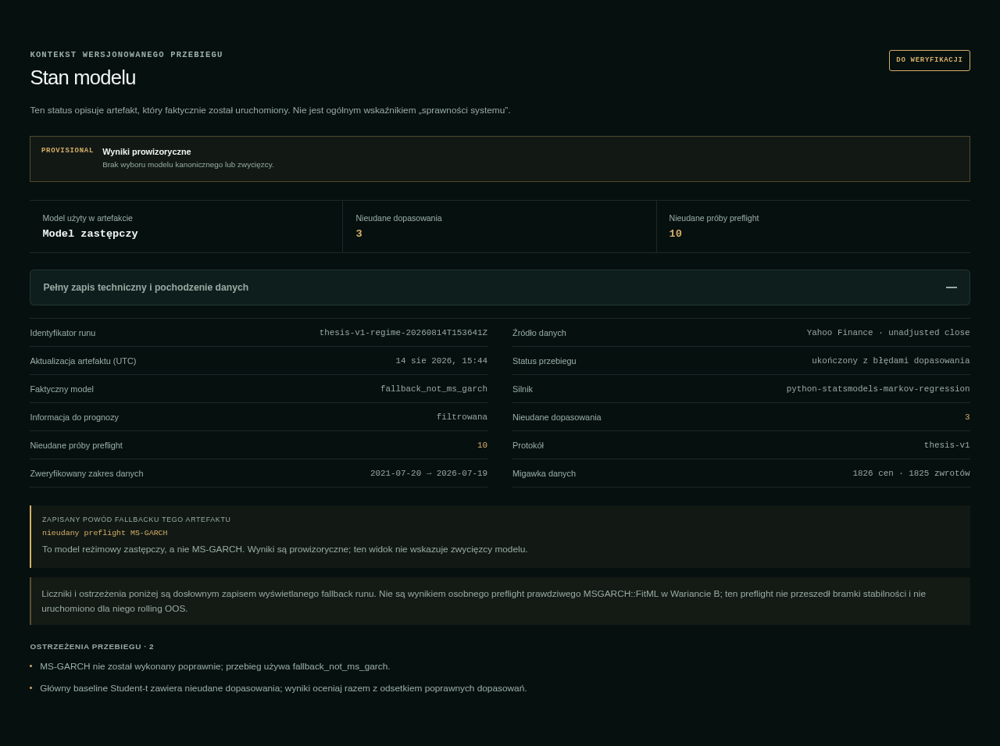

# RegimeSentinel

RegimeSentinel to pakiet reprodukcyjny pracy magisterskiej o modelowaniu zmienności i jednodniowej prognozie ryzyka dla BTC-USD i ETH-USD. Analiza obejmuje bazowy model `GARCH(1,1)`, dwustanowego kandydata `MS-GARCH` oraz miary `VaR` i `Expected Shortfall` oceniane w rolling backteście.

Repozytorium zawiera zamrożone dane, protokół `thesis-v1`, kod obliczeniowy i artefakty wynikowe. Aplikacja jest warstwą prezentacji tych materiałów: ułatwia odczyt wyników, ograniczeń i pochodzenia danych, ale nie zastępuje pakietu reprodukcyjnego.

## Najważniejszy wynik

Baseline `GARCH(1,1)` wykonano dla obu instrumentów. `MSGARCH::FitML` działał technicznie, a druga kontrolowana próba dała 10/10 poprawnych dopasowań. Kandydat nie przeszedł jednak zamrożonej bramki powtarzalności, dlatego rolling OOS (out-of-sample — na danych spoza dopasowania) MS-GARCH nie został uruchomiony. `fallback_not_ms_garch` jest odrębnym modelem zastępczym i nie jest wynikiem MS-GARCH. Nie wybrano zwycięzcy.

## Aplikacja

Demo: [RegimeSentinel na GitHub Pages](https://aleksanderpostrzednik.github.io/RegimeSentinel/)

Dwa widoki aplikacji: [monitoring dzienny](#monitoring-dzienny) i [wyniki badania](#wyniki-badania). Zrzuty z 05.09.2026, w trybie ciemnym. Kliknięcie obrazu otwiera pełną rozdzielczość.

### Monitoring dzienny

**01 · Ocena reżimu i ryzyko**

Odczyt ostatniej doby, prognoza reżimu oraz jednodniowe miary ryzyka dla BTC.

**02 · Historia rynku**

Cena ETH, dzienne zwroty i zmienność zrealizowana, wraz z rozwiniętym objaśnieniem wykresów.

**03 · Dane i model**

Źródło i zakres obserwacji, identyfikator publikacji oraz rozróżnienie modelu reżimowego i GARCH.

### Wyniki badania

**04 · Reżimy na zamrożonych danych**

Status badania, kompletność artefaktu oraz pełna historia ceny BTC z oznaczeniami reżimów.

**05 · Ryzyko i walidacja**

Miary ryzyka ETH, przekroczenia VaR i wyniki testów, z wyjaśnieniem ich interpretacji.

**06 · Stan modelu i ograniczenia**

Faktyczny model, pełny zapis techniczny i ostrzeżenia dotyczące wyświetlanego przebiegu.

## Zawartość repozytorium

- `experiments/thesis-v1/` — zamrożony protokół eksperymentu i jego konfiguracja.
- `data/snapshots/` — wersjonowane snapshoty danych wejściowych.
- `worker/` — kod obliczeniowy i pipeline reprodukcyjny.
- `artifacts/thesis-v1/` — artefakty wynikowe, manifesty i raporty.
- `contracts/` — kontrakty danych i schematy walidacyjne.
- `screenshots/` — obrazy użyte w galerii aplikacji.

## Odtworzenie wyników

Pełna instrukcja znajduje się w [REPRODUCIBILITY.md](REPRODUCIBILITY.md). Opisuje przygotowanie środowiska, walidację zamrożonych wejść, uruchomienie obliczeń oraz kontrolę manifestów i hashy.

Chronologia ma znaczenie: `fallback_not_ms_garch` powstał przed dwiema kontrolowanymi próbami `MSGARCH::FitML`. Druga próba dała 10/10 poprawnych dopasowań, ale nie spełniła kryterium powtarzalności. Fallback jest odrębnym modelem i nie zastępuje wyniku MS-GARCH.

## Jak czytać historyczne artefakty

Artefakty baseline’u pokazują wykonane obliczenia `GARCH(1,1)`. Artefakty prób `MSGARCH::FitML` dokumentują działanie techniczne dopasowania oraz wynik zamrożonej bramki. Artefakty `fallback_not_ms_garch` opisują odrębny model zastępczy. Żaden z tych materiałów nie oznacza wykonania rolling OOS MS-GARCH ani wyboru zwycięzcy.

## Dane i licencja

Kod jest udostępniony na licencji MIT. Dane pochodzą z Yahoo Finance; licencja MIT nie obejmuje praw do danych źródłowych. Szczegóły dotyczące danych opisuje `DATA_NOTICE.md`.

## Granice badania

- Zakres obejmuje BTC-USD i ETH-USD oraz dane dzienne.
- Analiza korzysta z jednego zamrożonego snapshotu i jednego protokołu `thesis-v1`.
- Bazowy `GARCH(1,1)` został wykonany, natomiast rolling OOS MS-GARCH nie został uruchomiony po niezaliczeniu bramki powtarzalności.
- `fallback_not_ms_garch` jest odrębnym modelem zastępczym, a nie modelem MS-GARCH.
- Wyniki nie uzasadniają wskazania jednego zwycięskiego modelu.

## Praca magisterska

**Tytuł:** „Detekcja zmian reżimu ryzyka: modele przełącznikowe i GARCH oraz walidacja VaR/ES w rolling backtest”

**Autor:** Aleksander Postrzednik
**Uczelnia:** Uniwersytet Ekonomiczny w Krakowie
